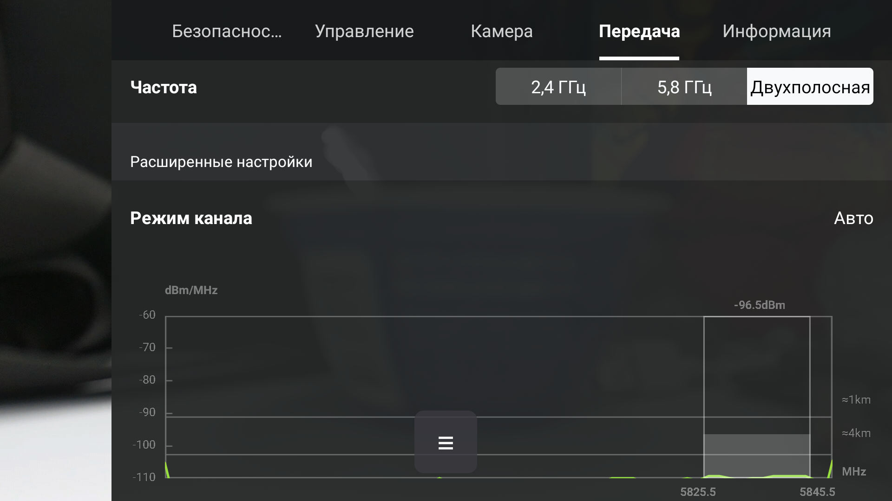

# DJI_FCC_GPSOFF

**English** · [Русский](README.ru.md)

An Android app for **DJI smart controllers with a screen — RC 2 (RM331) and RC (RM330)**.

It talks to the aircraft over **DUML** through the controller's own loopback TCP proxy — no USB, no AOA, no
root. Hardware-validated on **DJI RC 2 (Android 11) + Lito X1**.

## What it can do

- **FCC power + 5.8 GHz / dual-band.** Applies live, no reboot.
- **Auto-start with the controller and auto-apply FCC** — a service arms on boot, waits for the link, and
  re-applies after every relink (DJI Fly pushes CE back).
- **Toggles, also from a floating menu over DJI Fly** — GPS, front LEDs, flight mode ATTI/Cine. The menu is a
  small ≡ handle on top of Fly; toggles fire without minimising it or interrupting the flight session.
- **Parameter editor.** Addresses parameters **by the hash of the name, not by parameter id** — names rarely
  change across firmware and often match across models, indices don't. On the same aircraft `ce_country_type`
  sat at index 239 under one firmware and 49 under the next; its name never moved. Before an edit the app
  asks the *aircraft* to describe the parameter (`03:F7`), so the range, width and default used to check the
  value come from the firmware in front of you rather than from a file — and **reset restores the board's own
  factory value** (`03:FA`), not a file's idea of it.
- **Three ways to get a parameter list.** Sets for 10 models are **bundled in the APK**; a **dronehack**
  export loads from a file (v1 `.dhp` or v2 `.dhv2params`, samples in [`params_example/`](params_example/));
  or the app **reads the whole catalogue off the aircraft over the radio** in about two minutes — for a drone
  no bundled set covers. A list from a *different* model is safe either way: an unknown name simply can't be
  read or written, and the app now says so explicitly instead of leaving you with an unanswered read.
  On the test aircraft the bundled list turned out to carry 94 names the firmware doesn't have and to miss 22
  it does — the kind of drift only the aircraft itself can settle.
- **Update check** against this project’s GitHub releases — optional, pre-releases off by default; shows
  the release notes and installs the APK on confirmation.
- **Russian or English interface**, switchable in the app and independent of the controller’s system
  language.
- **Web dashboard** for a browser on the same network — parameter editor, the app's own functions, screen
  recordings, flight-log download, traffic capture as `.pcap` (Wireshark), raw DUML requests.

## Installing

Download the APK from [Releases](https://github.com/lmdegreeds/dji_fcc_gpsoff/releases) and install it **on
the controller** (copy it over MTP, or open the link in the controller's browser). Android will ask you to
allow installs from that source once.

Every release is signed with the project's key. An APK from anywhere else, or a self-built debug APK, cannot
be installed over an existing one — Android rejects a signature change. Uninstall first if you switch.

## First launch

A **setup wizard** opens. It explains each permission in turn — why it is wanted and exactly what to tap on
the system screen it opens — and finishes by asking which services to start now and which to autostart:

| Step | | |
| --- | --- | --- |
| **Accessibility** | recommended | Gates every read on DJI Fly's video port so it can never blip the video, and reads the aircraft model off Fly's screen |
| **Install unknown apps** | optional | Lets the app install its own updates later |
| **Flight logs / recordings** | optional | Folder access for the log download and video pages of the web dashboard |
| **Parameter names** | — | Short (Lito X1) or long `g_config.*` — by hand, or auto-detected with the aircraft powered up |
| **What to enable** | — | Auto FCC, floating menu, web dashboard — one switch per service (runs it and arms its auto-start) |

Everything after the first page can be skipped; the app works with every optional grant declined, with
honest degradations shown in the UI. Language is switchable in the wizard's header, and the wizard can be
re-opened any time from the ⋮ menu.

## Using it

1. Power up the aircraft and let DJI Fly show a live link.
2. Pick the **device profile** — *Lito X1* (short names) or *Other DJI* (`g_config.*` / `c1_*`). The setup
   wizard asks for it on its own step and can detect it for you with the aircraft powered and linked; later
   it lives in **⋮ → Settings**. The result is remembered per serial. There is no probe on every launch any
   more — it cost FCC frames on DJI Fly's port (2026-08-19). FCC itself does not depend on the profile: the
   power and 5.8 GHz frames are addressed by radio receiver and hardware register, not by parameter name.
   LED, GPS, ATTI/Cine and writes from the parameter editor do.
3. Press **⚡ Enable FCC**, or turn on **Auto FCC** and let the keepalive apply it on every connect.
4. Verify in DJI Fly → **Transmission**: the band choice and the power graph appear immediately, no reboot.
   Allow up to ~20 s for the write to land.

**FCC region** — the country code that goes out as the ASCII bytes of the `07:30` frame is chosen in
**⋮ → Settings**: `AU`, `CN`, `US`, `BO`, `RU`, `NL`, `MY`, the codes the firmware accepts. `AU` is the
default and the only one the switch has been confirmed with on hardware. The chosen code is used everywhere —
a manual apply, auto FCC, and the floating menu's button.

**Floating menu** — a ≡ handle over DJI Fly with GPS / LED / flight-mode toggles that fire without leaving
Fly. Needs the "display over other apps" permission. The parameter editor has a **"Menu"** column: up to six
of your own parameters can be pinned into that same panel. Their buttons come from the parameter's own limits
(`ON`/`OFF` for a 0/1 parameter, otherwise `min` / `def` / `max`), because a window over Fly cannot take
keyboard input.

**Parameter editor** — get a list with **📂 From file** (a dronehack `.dhp` / `.dhv2params` export),
**📦 From set** (bundled in the APK) or **📡 From aircraft** (reads the whole table over the radio, ~2 min —
stop DJI Fly first, it shares the port). Then search, read and write by name. Each editor dialog shows a
`catalog:` line and a `board:` line: where they disagree you see both, and a parameter the firmware doesn't
have is called out as absent with its write and reset disabled, rather than accepting a write that goes
nowhere.
**Back the aircraft's parameters up with DJI Assistant 2 over USB first**: there is no undo here, and the
originals are the only way back.

**Web dashboard** — enable it in **⋮ → Diagnostics** and open `http://<rc-ip>:8899/` (the URL is shown there; the
IP changes across reboots). `curl .../help` lists every raw endpoint. It binds `0.0.0.0:8899` with **no
authentication** — a debug tool for a trusted LAN; turn it off when done.

**Updates** — checked against GitHub on launch (at most every 6 h) when enabled in **⋮ → Settings**. A newer
release opens a dialog with its release notes; nothing is downloaded or installed without confirmation.
Pre-releases are only offered if you opt in.

> **FCC-only build.** Restore CE was removed on purpose — reverting drops 5.8 GHz and needs an aircraft
> reboot. `ce_restore.json` stays as reference; nothing plays it.

## How it works

Three loopback DUML proxies on `127.0.0.1`, all **multi-client** — DJI Fly keeps its own session, so nothing
is hijacked. **40009** (RADIO/SDR) carries FCC and 4G; **40008** carries parameter writes; **40007** is DJI
Fly's FPV video mirror — the app **never writes to it** and gates every read on it, because a socket there
freezes Fly's video for ~1–2 s.

Apply FCC plays a 21-frame sequence on 40009 whose core is two **SDR register writes** (`0xffff0048` = 2 =
`setForceFcc`, `0xffff0063` = 3), plus region/country frames and a regulatory parameter write in the current
profile's spelling. Parameters are addressed by a runtime hash of their **name**, never by index. The
floating menu can toggle parameters mid-flight because it never takes the foreground away from DJI Fly and
its writes go to ports Fly isn't watching.

**Full detail — frame-by-frame tables, hashes, keepalive timings, 4G, the Lito X1 naming problem, the
overlay and accessibility mechanics, serial/model detection, log access — is in
[`doc/PROTOCOL.md`](doc/PROTOCOL.md).**

## Build

**JDK 17 or 21** (Gradle 8.9 rejects JDK 25); NDK and CMake are fetched automatically. Android Studio ▸
*Build APK(s)*, or `./gradlew :app:assembleDebug` (tests: `:app:testDebugUnitTest`); CI builds the debug APK.
[`native/`](native/) holds the core — framing, CRCs, runtime parameter hashing, the loopback transport,
one-shot `send_once`, the aux reader for 40007.

Release builds are signed from an un-committed `keystore.properties`. Without it `assembleRelease` still
works but falls back to the debug key, and prints which key it used — an APK signed with the debug key
cannot update an installed release, so check that line before publishing.

## Status

Verified on hardware: Apply FCC (power **and** 5.8 / dual-band, live, firmware v300 and v400); auto-apply and
relink recovery; the port map; GPS / LED / mode writes; serial read and link detection; parameter metadata and
reset-to-default read off the aircraft; a full 1594-slot table read (twice, identical both times). Parameter
*reads* do come back, on the wrapped 40007 route only — about 70% of single windows with DJI Fly in the
background, which is why every read retries. Not fully verified: 4G (needs a Cellular Dongle); non-Lito
parameter names. Research notes in [`doc/`](doc/).

**Credits.** FCC payloads and the `51:1A` 4G frame from **FreeFCC / SkylabFCCfree** (AGPL-3.0); the
floating-window mechanism from **lmdegreeds/dji_gpsoff** (window code only — its parameter-by-index DUML code
is not used). See [NOTICE](NOTICE).

**Contact.** [t.me/degreeds](https://t.me/degreeds)

**License.** [AGPL-3.0-or-later](LICENSE).

> **Disclaimer.** This software changes radio regulatory settings on your aircraft. Transmit power and
> frequency limits are set by law and differ by country. You are responsible for operating within the rules
> that apply to you. Provided as-is, with no warranty.
